# Discounting-rate-Prediction-Model-based-on-Customer-s-Profile-for-Ecommerce-website
Every customer wants the best price, on the other hand, every retailer wants the best margin with customer satisfaction and an increase in the count of a loyal customer. For that retailer try to identify the loyalty of the customer and offer a special discount to them. In the current situation, there is a lack of identifying loyal customers, measuring their loyalty and offering personalized offers on an online ecommerce platform.    In this project, the main aim is to build a machine learning model which can predict discount for ecommerce websites based on customer loyalty. 

# Dependencies and Requirements
**Libraries used:**
    
	flask 1.1.2:
    Flask is a lightweight WGSI(Web Server Gateway Interface) web application framework. It began as a simple wrapper around werkzeug and jinja and has become one of the most popular Python web application frameworks
    License: BSD-3-Clause
 
    cloudpickle 1.3.0:
    Cloudpickle 0.8.1 is used for serializing and de-serializing 
    License: BSD 3-Clause

    numpy 1.18.1:
    A fundamental package for array computing in python
    License: OSI Approved (BSD)

    pandas 0.25.3:
    Pandas is an open source, easy to use data structures and data analysis tools for Python programming language
    License: BSD Licence

    matplotlib 3.2.1:
    Matplotlib is a comprehensive library for creating static, animated, and interactive visualizations in Python.
    License: PSF

    scikit-learn 0.22.1:
	Scikit-learn is a free software machine learning library for python programming.
	License: BSD 3-Clause
	
	keras 2.3.1:
    Keras is an API designed for human beings, not machines. Keras follows best practices for reducing cognitive load: it offers consistent & simple APIs, it minimizes the number of user actions required for common use cases, and it provides clear & actionable error messages. It also has extensive documentation and developer guides.
	License: MIT
	
	requests 2.22.0:
	Python HTTP for Humans.
	License: Apache 2.0
	
	TensorFlow 1.13.0:
	TensorFlow is an open-source machine learning framework for everyone.
	License: Apache 2.0

**Tools:**

IDE:
    PyCharm Community Edition for Flask API.
    Spider for the ML model
    Visual Studio Code and Atom for plugin

Analysis:
    Weka for model testing and data analysis.

Testing:
    Insomnia for testing Flask API and Plugin Rest API.

**System Environment:**

Processor:  			2.5 gigahertz (GHz) or faster processor.

RAM:    				8 GB or more 

Hard drive space: 		48 GB for 64-bit OS or Higher

Operating Systems:		Linux 18.04 or Higher
						Windows 10

GPU: 					NVIDIA GTX 1050(4 GB) Compute Capability 3.5 or higher.

Language: 				Python 3.6.

Tool:					Anaconda 3-5.2.0-Linux.
						Anaconda3-5.2.0-Windows-x86_64.
						Xampp v3.2.4

Internet Connection: 	Internet connectivity is necessary to download some Libraries. Internet connection required during the training of the ML model.

# Instructions for Deployment

Step 1: Download and install Python 3.6.

Step 2: Download and install WordPress on Web Server with WooCommerce Plugin.

Step 3: Clone project repo to a file.
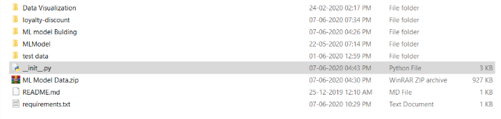

Step 4: Create a new python virtual environment and activate. And install packages which are in requirement.txt.
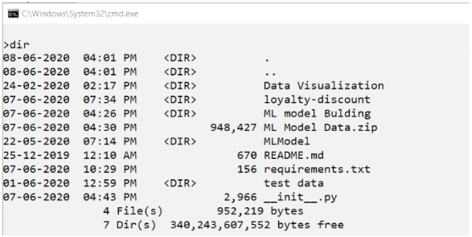
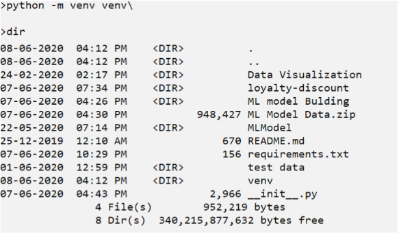
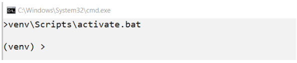
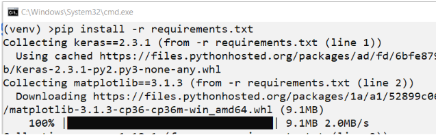

Step 5: Start Flask API by just running __init__.py file and after some time stop.
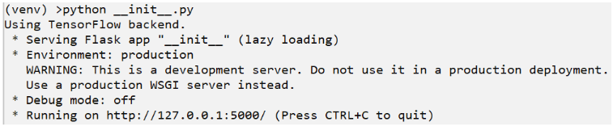

Step 6: Copy the loyalty-discount folder to the WordPress Plugin folder.
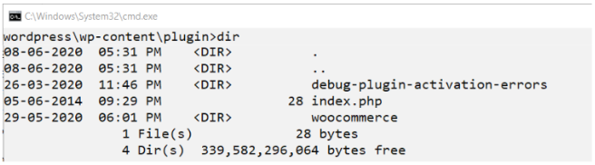
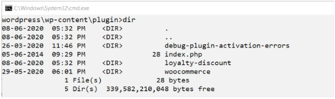

Step 7: Start WordPress and Activate Installed Plugin with WooCommerce Plugin. Start WooCommerce plugin and Loyalty Discount Plugin.
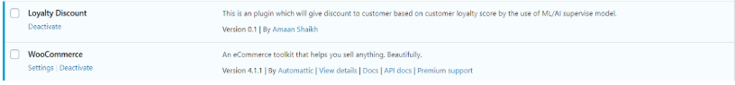
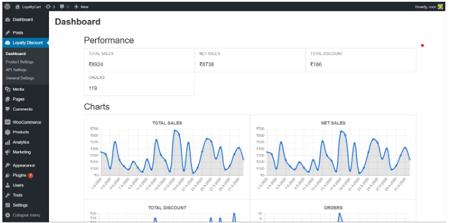

Step 8: Goto API Setting tab. And click on Create Button. Fill the form and click on the Generate button.
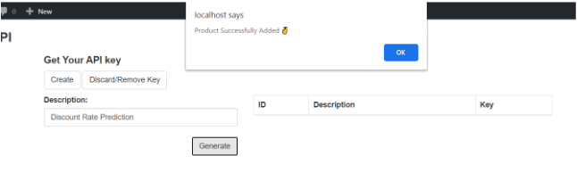

Step 9: Copy the Security Key and past in __init__.py user variable. Run the flask again.
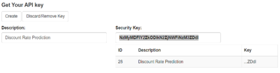
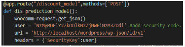
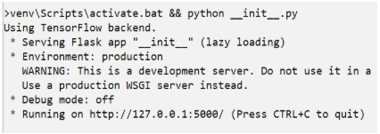

